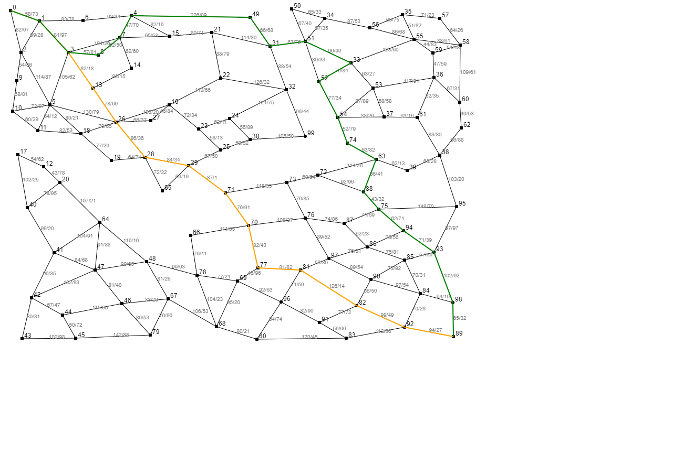

# Path finder

A simple Dijkstra's web path finder.
Just choose two vertices and the shortest path between them will be shown.

 - *orange* color is for shortest path by length
 - *green* color is for shortest time by time (measuring given node weights)

Node weights can be displayed by switcher, in this format: *length/speed on node*

